# 3D打印机喷嘴正常/异常二分类数据集分析报告（clean_v3）

> 本报告由只读分析程序生成。分析过程未修改clean_v3中的任何图片或标签；test仅参与数据完整性和分布审计，不用于模型选择或调参。

## 1. 数据版本与业务定义

- 数据集：`dataset_2_abnormal_binary_clean_v3`
- 来源：冻结的`dataset_2_binary_clean_v2`
- 继承内容：完全重复去除、相似帧抽取、相似簇整组划分和既有框坐标
- 本次变更：删除唯一的`camera_occlusion`图片及标签；将其余6个原始类别重新映射为正常/异常
- 类别0 `nozzle_normal`：`nozzle_clean`、`nozzle_extrusion_normal`、`nozzle_no_extrusion`
- 类别1 `nozzle_abnormal`：`nozzle_heavy_contamination`、`nozzle_slight_contamination`、`nozzle_tip_wrapped`

本次共重映射3670份标签，保留框的中心坐标、宽度和高度全部不变。源clean_v2没有被覆盖或修改。

## 2. 完整性检查结果

| 检查项 | 结果 |
|---|---:|
| 图片总数 | 3670 |
| 标签文件总数 | 3670 |
| 目标框总数 | 3670 |
| 缺失图片或标签 | 0 |
| 无效YOLO标签 | 0 |
| 类别越界 | 0 |
| 疑似前缀/类别不一致 | 0 |
| 完全重复图片组 | 0 |
| 跨train/val/test完全重复组 | 0 |

每张图片对应一个标签文件和一个目标框。`camera_occlusion`已从train中删除，clean_v3中不再存在该前缀。

## 3. 数据划分与类别分布

| 数据划分 | 图片/框 | 正常（0） | 异常（1） | 正常占比 | 异常占比 |
|---|---:|---:|---:|---:|---:|
| train | 2568 | 1634 | 934 | 63.63% | 36.37% |
| val | 550 | 344 | 206 | 62.55% | 37.45% |
| test | 552 | 347 | 205 | 62.86% | 37.14% |
| 合计 | 3670 | 2325 | 1345 | 63.35% | 36.65% |

三个集合的类别比例接近，说明删除1张图片和重新映射后没有破坏分层一致性。正常类约为异常类的1.73倍，存在中等程度不均衡，但尚未严重到必须立即使用过采样或类别权重；基线阶段先保持YOLOv5标准配置，重点观察异常类Recall。

## 4. 目标框大小与形状

框等效尺寸按图片letterbox到640后统计：

| 数据划分 | 32–64像素 | 64–128像素 | ≥128像素 |
|---|---:|---:|---:|
| train | 71 | 2137 | 360 |
| val | 3 | 475 | 72 |
| test | 3 | 474 | 75 |

数据中没有小于32像素的框，大多数目标集中在64～128像素，因此该任务不是典型小目标检测。train中32～64像素目标比例高于val/test，后续应结合逐图抽查确认这是正常工况差异，而不是划分偏差。

train框宽高比均值为3.8917、中位数为3.9948；val均值为3.9335、中位数为3.9948。框整体偏宽，且train/val形状分布接近。归一化框宽主要约为0.23～0.61，归一化框高约为0.066～0.272。

## 5. 图像质量与关键发现

以下质量统计基于train和val，共3118张图片：

| 指标 | 最小值 | 中位数 | 均值 | 95分位 | 最大值 |
|---|---:|---:|---:|---:|---:|
| 平均亮度 | 30.06 | 111.01 | 106.99 | 134.53 | 165.33 |
| 过曝像素比例 | 0.40% | 8.01% | 8.88% | 18.69% | 47.76% |
| Laplacian方差 | 6.51 | 87.04 | 137.81 | 316.58 | 495.39 |

关键发现：

1. 数据存在明显亮暗差异，最低平均亮度约30，说明模型需要适应暗光工况。
2. 少量图片过曝比例很高，最高达到47.76%；应从`tables/overexposed_images.csv`抽查这些候选，确认喷嘴关键区域是否仍可辨认。
3. Laplacian方差最低为6.51，存在模糊候选；该分数只负责排序，不能机械地将低分图片判定为错误，需结合人工视觉复核。
4. train与val的类别比例、框形状和主要目标尺寸整体接近，适合用于基线训练与验证比较。
5. 当前数据多为固定机位和相似背景，内部val表现不能代替跨时间、跨光照、跨设备的工业泛化测试。
6. test必须继续封存；在网络、增强、超参数和置信度阈值全部确定之前，不查看test模型指标。

## 6. 分析图表

### 图1：train类别分布

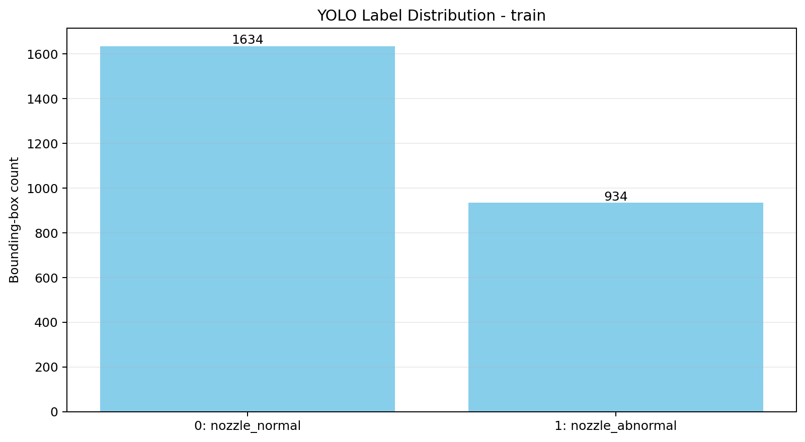

`figures/01_train_class_distribution.png`展示train中正常与异常目标框数量，用于检查训练类别不均衡程度。

### 图2：val类别分布

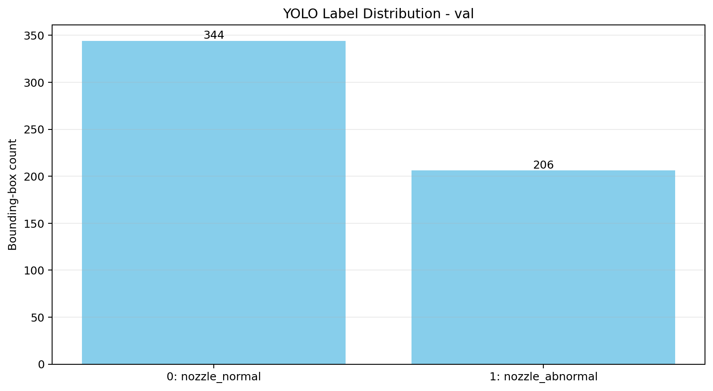

`figures/02_val_class_distribution.png`用于核对val与train的类别比例是否一致，避免验证结果被明显不同的类别构成影响。

### 图3～图4：train/val目标框大小分布

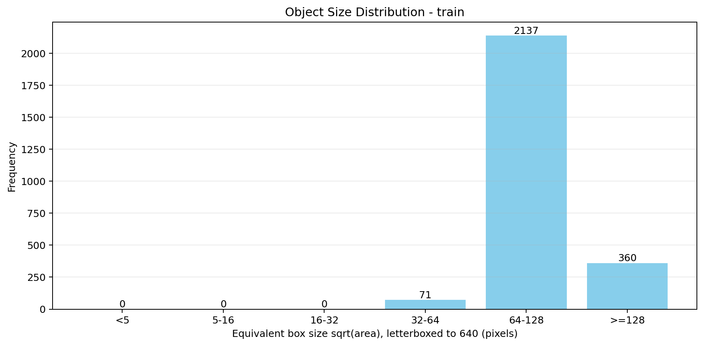

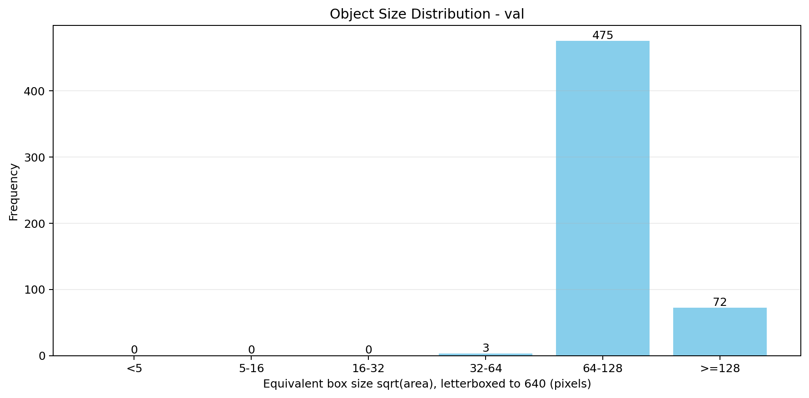

`figures/03_train_object_size_distribution.png`和`figures/04_val_object_size_distribution.png`把框映射到640输入尺度后分档，用于判断是否属于小目标任务，以及train和val尺度是否一致。

### 图5～图6：train/val目标框比例和宽高分布

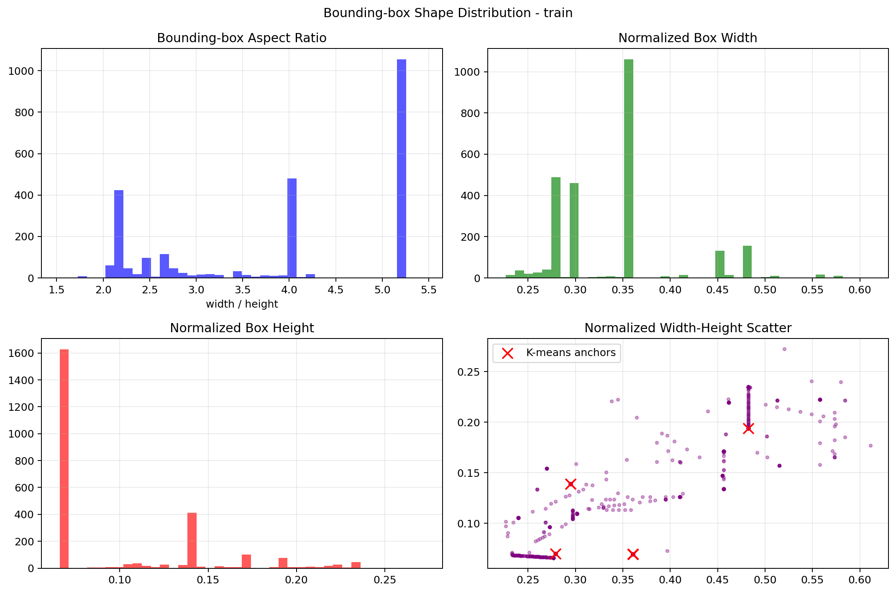

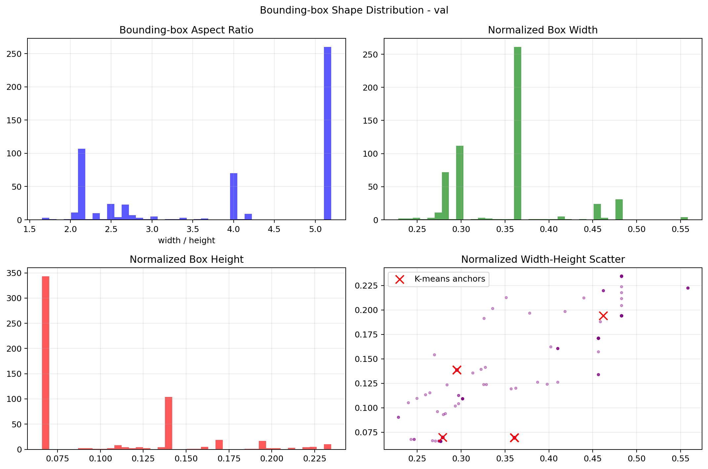

`figures/05_train_bbox_shape_distribution.png`和`figures/06_val_bbox_shape_distribution.png`展示宽高比、归一化宽高及宽高散点，用于发现固定框模板、异常框和尺度偏置。

### 图7～图8：train/val RGB直方图

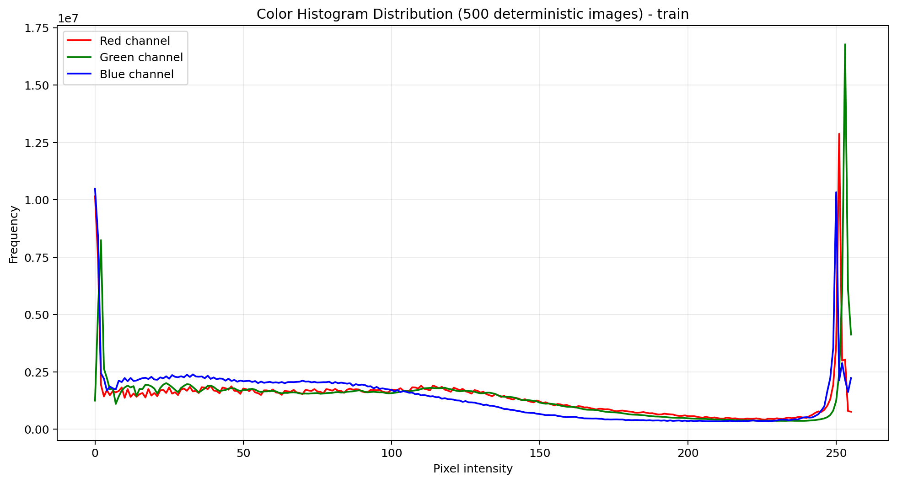

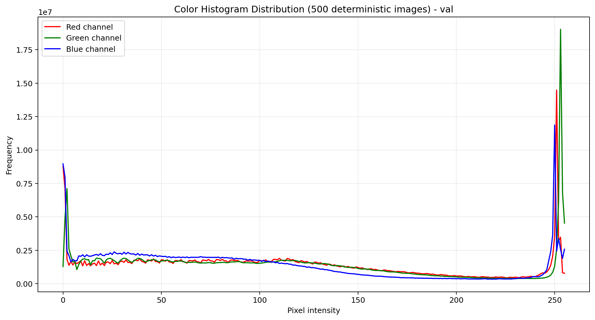

`figures/07_train_rgb_histogram.png`和`figures/08_val_rgb_histogram.png`展示确定性抽样图片的RGB像素分布，用于比较颜色和曝光域差异。

### 图9：train与val平均亮度分布

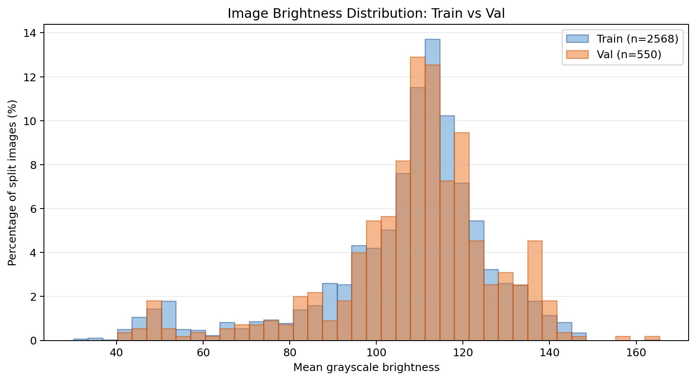

`figures/09_brightness_distribution.png`将train和val叠加显示并分别着色，用于判断验证集是否明显更亮或更暗。

### 图10：train与val过曝比例分布

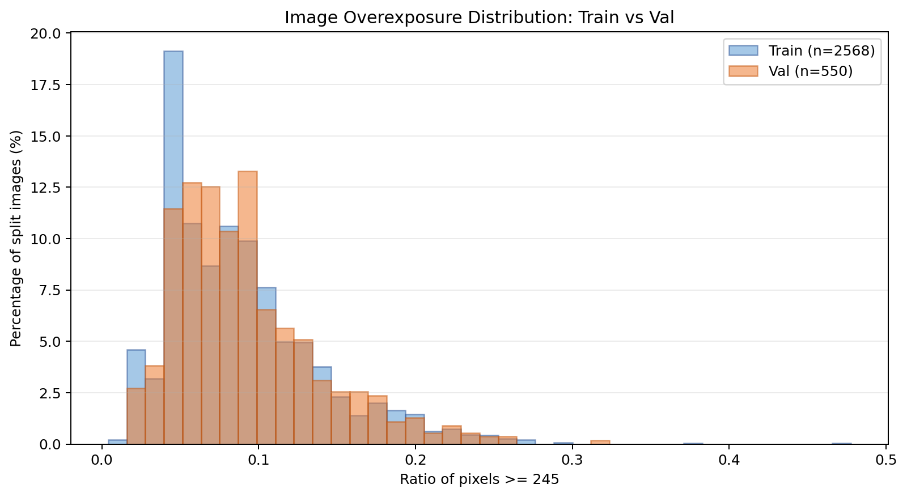

`figures/10_overexposure_ratio_distribution.png`统计灰度值≥245的像素比例。高过曝不必然等于坏图，但可能导致金属喷嘴细节消失。

### 图11：train与val清晰度候选分布

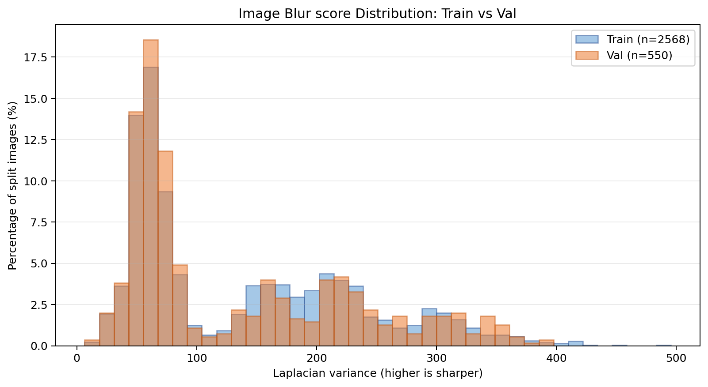

`figures/11_blur_score_distribution.png`使用Laplacian方差描述边缘丰富程度。分数越低通常越模糊，但固定背景和目标纹理也会影响分数，因此只用于生成复核候选。

## 7. 训练前结论

clean_v3已满足训练前基本条件：图片标签一一对应、类别只含0和1、框坐标有效、无完全重复、无跨集合完全重复、类别比例稳定。下一步应先冻结clean_v3并通过自动哈希验证，然后使用与上一轮完全相同的YOLOv5s、预训练权重、输入尺寸、batch、epoch、worker、seed、优化器和官方增强配置重新训练B0。除数据集路径和类别语义外，不改变其他实验条件。

本报告配套明细位于`tables/`，11张图位于`figures/`，机器可读汇总为`dataset_analysis_summary.json`。
