# 3D打印机缺陷检测数据集分析报告（raw_v1）

> 分析对象为未经清洗的原始数据 `dataset_2`。本次分析全程只读，没有修改、移动或删除任何图片和标签。

## 1. 数据集概况

- 数据集路径：`D:\ruanjianxiazai\pycharm2026\datasets\dataset_2`
- 图片总数：4699
- 标签框总数：4699
- 标签格式异常：0
- 待人工审核标签：4
- 完全重复图片组：916
- 跨训练/验证/测试集合的重复图片组：419

| 数据划分 | 图片数 | 标签框数 | 类别0：wrapped | 类别1：not_wrapped |
|---|---:|---:|---:|---:|
| 训练集 train | 3289 | 3289 | 950 | 2339 |
| 验证集 val | 704 | 704 | 187 | 517 |
| 测试集 test | 706 | 706 | 182 | 524 |
| 合计 | 4699 | 4699 | 1319 | 3380 |

每张图片当前均对应一个标签文件和一个检测框。类别1约为类别0的2.56倍，存在一定类别不平衡。

## 2. 数据完整性检查

本次检查包括图片与标签配对、图片可读取性、标签列数、数值类型、类别范围、归一化坐标范围、边界框越界、空标签、孤立标签和重复框。

检查结果：

- 未发现缺失标签或孤立标签；
- 未发现损坏或无法读取的图片；
- 未发现空标签和非五列YOLO标签；
- 未发现类别越界、坐标越界或宽高非正数；
- 未发现同一标签文件中的完全重复框。

完整明细见 `tables/integrity_issues.csv` 和 `tables/object_size_details.csv`。

## 3. 类别分布

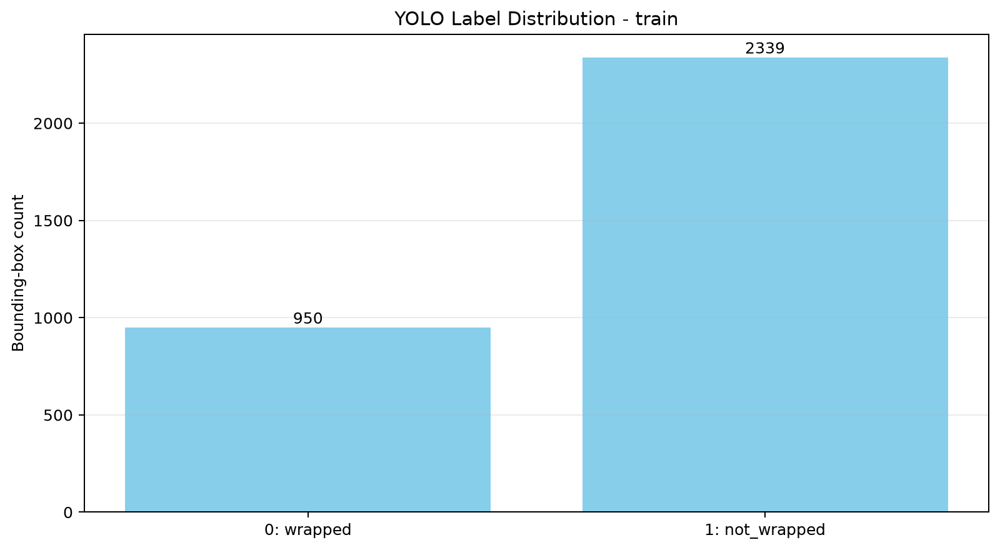

**图1：训练集类别分布。** 类别0为950个，类别1为2339个，比例约为1:2.46。

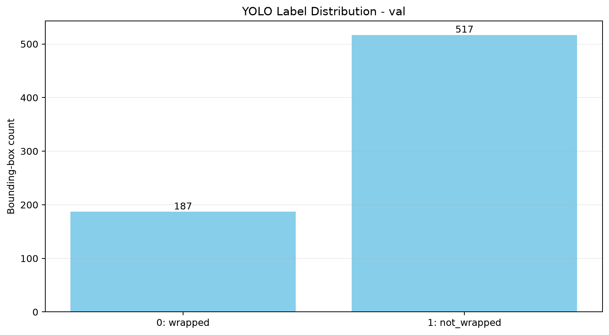

**图2：验证集类别分布。** 类别0为187个，类别1为517个，比例约为1:2.76。

训练集和验证集均表现为类别1多于类别0，两者分布方向一致。类别不平衡可能导致模型更偏向类别1，后续基线训练需要分别观察两个类别的精确率和召回率；是否启用 `--image-weights` 应通过对照实验决定，不能仅凭比例直接开启。

## 4. 目标框大小分布

为复现实验文档中的统计口径，先按YOLOv5 letterbox规则将图片最长边缩放到640像素，再用 `sqrt(缩放后框面积)` 作为等效框尺寸分档。

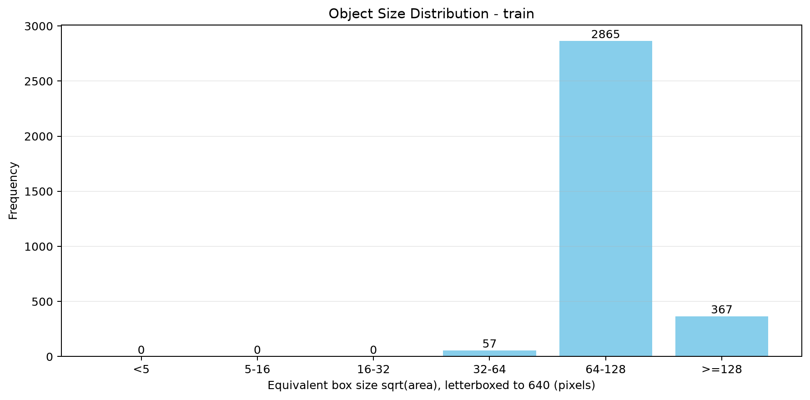

**图3：训练集目标框大小分布。** 32～64像素57个，64～128像素2865个，大于等于128像素367个。

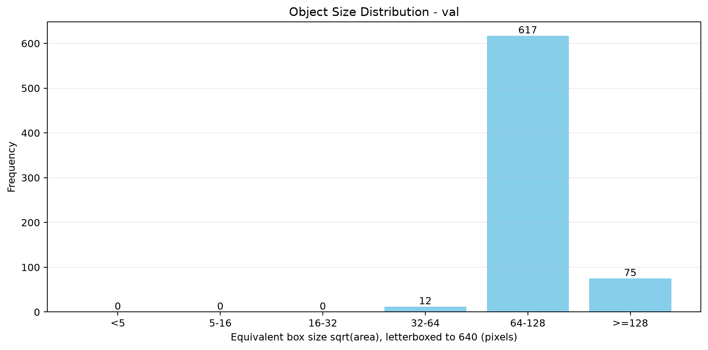

**图4：验证集目标框大小分布。** 32～64像素12个，64～128像素617个，大于等于128像素75个。

关键发现：

- 训练集和验证集都以64～128像素的中等尺寸目标为主；
- 小于64像素和大于等于128像素的样本相对较少；
- train与val的尺寸分布基本一致；
- 后续应分别检查少量较小、较大目标的召回率，不建议在分析阶段直接移除它们。

## 5. 目标框比例与Anchor分布

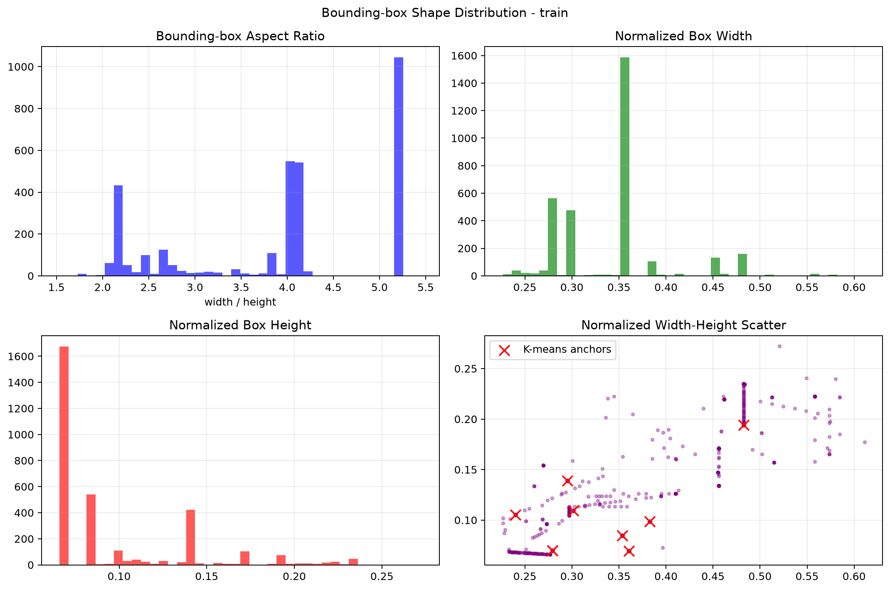

**图5：训练集目标框宽高比、归一化宽度、归一化高度和宽高散点图。红色叉号为9组K-means候选Anchor中心。**

训练集统计：

- 宽高比范围：1.5326～5.4514；
- 平均宽高比：3.9213；
- 宽高比中位数：3.9948；
- 归一化宽度范围：0.2265～0.6111；
- 归一化高度范围：0.0660～0.2724。

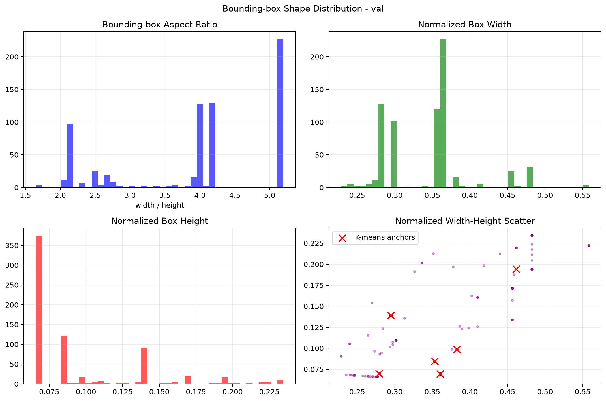

**图6：验证集目标框宽高比、归一化宽度、归一化高度和宽高散点图。**

验证集统计：

- 宽高比范围：1.6519～5.1971；
- 平均宽高比：3.9499；
- 宽高比中位数：4.1770；
- 归一化宽度范围：0.2287～0.5580；
- 归一化高度范围：0.0660～0.2346。

### 关键发现

1. 目标整体呈现较宽、较矮的横向长方形特征，平均宽高比约为3.95。
2. 宽高比分布跨度较大，存在接近方形和明显细长的框。
3. 归一化宽度相对集中，归一化高度差异更明显。
4. train与val的几何分布接近，数据划分在框形状方面具有一致性。
5. 9组K-means候选Anchor结果保存在 `tables/anchor_clusters.csv`。该分析适用于YOLOv5；YOLOv8为anchor-free模型，不能用“单一Anchor限制”解释YOLOv8。

## 6. 图像质量分析

RGB直方图按固定随机种子 `20260822` 从train和val分别抽取500张图片，因此重复运行可以得到相同样本。抽样清单保存在 `tables/rgb_histogram_sample_manifest.csv`。

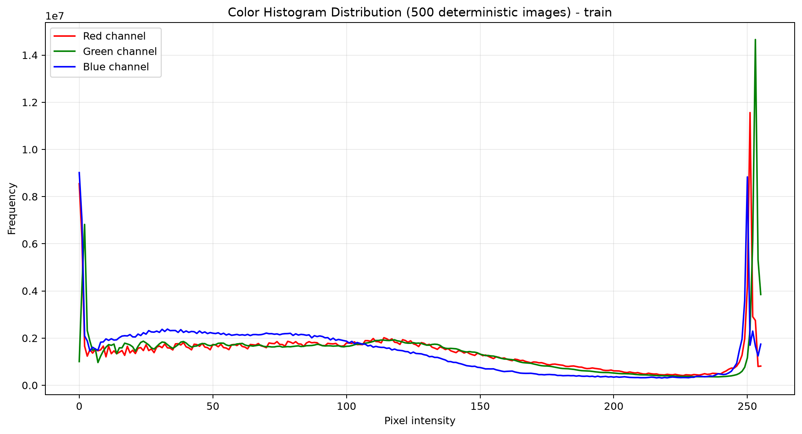

**图7：训练集固定抽取500张图片的RGB颜色直方图。** 高灰度区域存在明显峰值，说明部分区域接近白色或高亮。

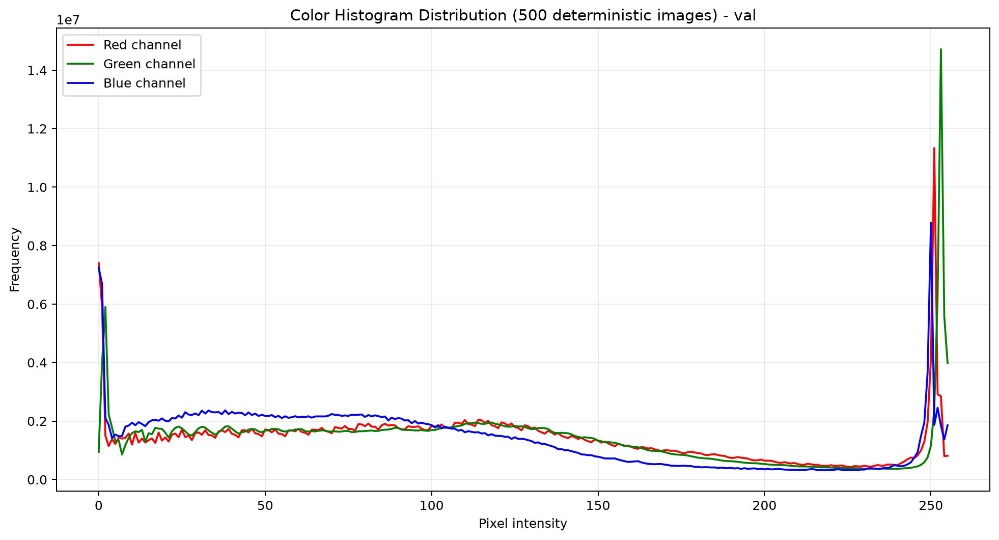

**图8：验证集固定抽取500张图片的RGB颜色直方图。** 分布趋势与训练集接近。

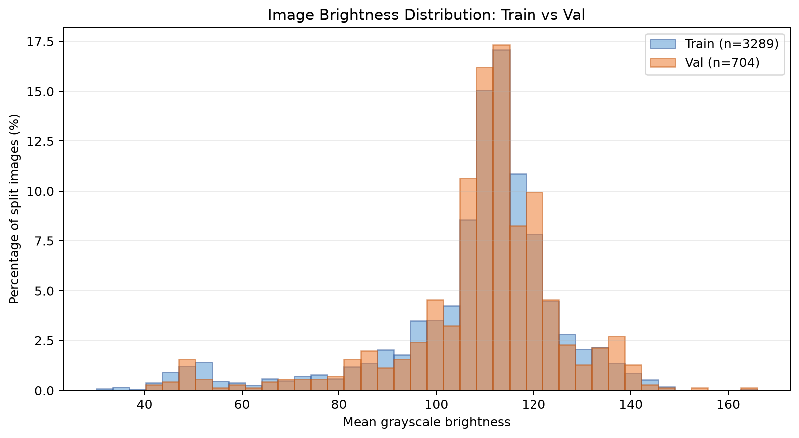

**图9：train和val的图像平均亮度对比分布。** 蓝色为train，橙色为val；两个集合分别归一化为100%，因此可以直接比较分布形状，不受样本数量差异影响。单张图平均亮度范围为30.06～165.96，总体均值为108.10。

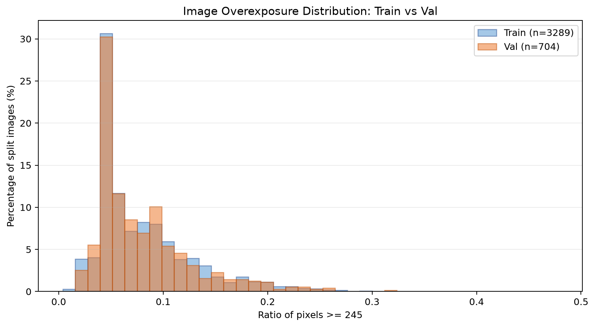

**图10：train和val中过曝像素比例的对比分布。** 蓝色为train，橙色为val；横轴表示单张图片中灰度值大于等于245的像素比例，纵轴表示该集合内图片百分比。总体平均过曝像素比例为7.93%，999张图片的过曝比例不低于10%，109张不低于20%，3张不低于30%，最高为47.76%。

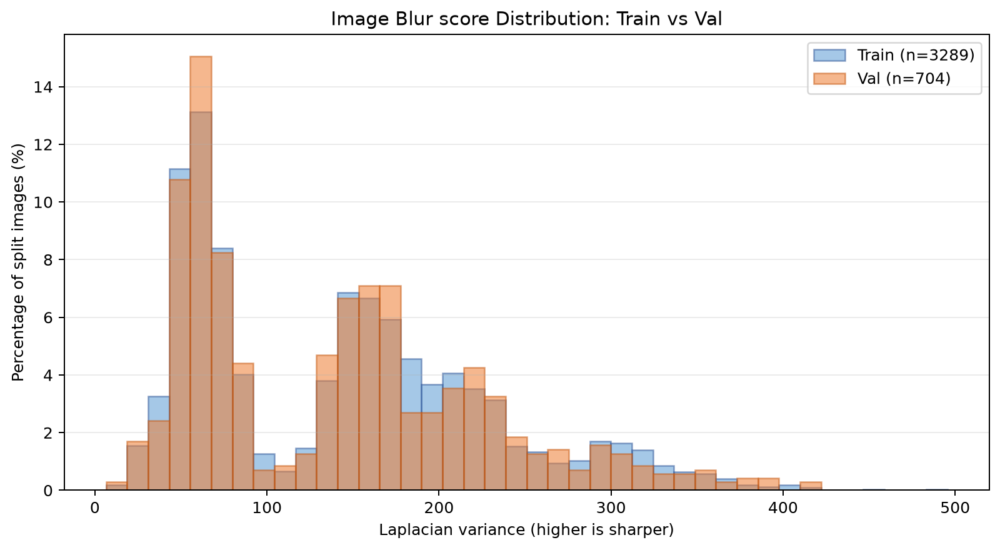

**图11：train和val的Laplacian方差对比分布。** 蓝色为train，橙色为val；两个集合分别归一化为100%。分数越低通常越模糊；57张不高于30，356张不高于50。该指标只用于筛选候选图片，最终仍需人工查看确认。

图像质量结论：数据中确实存在明显高亮和局部过曝现象，可能造成喷头边缘、污染物和裹头区域纹理丢失。后续应优先核查 `tables/overexposed_images.csv` 和 `tables/blurred_images.csv` 中排名靠前的图片，再决定硬件光源调整或数据增强策略。

## 7. 疑似标签审核

根据同一文件名前缀的多数类别一致性，筛出4个标签。2026年8月23日已由人工结合原图完成复核：前三张属于无裹头，最后一张属于裹头。

| 文件 | 当前类别 | 人工复核结论 | 按当前二分类定义拟修正为 |
|---|---:|---|---:|
| nozzle_extrusion_normal_0004 | 0 | 无裹头 | 1 |
| nozzle_heavy_contamination_0001 | 0 | 无裹头 | 1 |
| nozzle_slight_contamination_0006 | 0 | 无裹头 | 1 |
| nozzle_tip_wrapped_0728 | 1 | 裹头 | 0 |

审核表位于 `suspect_labels.csv`。以上结论应先登记到审核表，不直接覆盖原始 `dataset_2`；待类别定义和去重规则最终确认后，再统一应用到新的清洗版本。

`camera_occlusion_0001` 因同前缀只有一张图片，无法通过多数规则判断，也应在人工审核时单独查看。

## 8. 完全重复图片与数据泄漏风险

SHA-256检查发现：

- 完全重复图片组：916组；
- 涉及图片：1832张；
- 每组均包含2张完全相同的图片；
- 跨train/val/test的重复组：419组。

这说明当前数据划分存在严重泄漏风险。同一画面如果同时出现在训练集和验证集或测试集，验证指标可能明显虚高，不能代表模型对新图像的泛化能力。

完整重复清单位于 `tables/exact_duplicate_images.csv`。在正式基线训练前，应按哈希组去重并重新划分，保证同一重复组只能出现在一个数据集合中。

## 9. test集合的使用原则

test参与文件完整性、标签格式和跨集合重复检查，但不得用于选择增强方式、超参数、置信度阈值或模型结构。所有调参应基于train和val；test应保留到最终方案确定后进行一次独立评测。

## 10. 结论与下一步建议

当前数据在文件完整性和YOLO标签格式方面合格，但在正式训练前仍存在三类关键问题：

1. 类别0与类别1约为1:2.56，存在类别不平衡；
2. 有4个标签需要人工审核，另有camera_occlusion样本需要单独确认；
3. 发现419组跨集合完全重复图片，必须优先处理数据泄漏。

建议后续顺序：

1. 保留原始 `dataset_2` 不动；
2. 将已确认的4项标签修正登记并应用到清洗版本；
3. 按SHA-256重复组去重；
4. 重新划分train/val/test，确保重复组不跨集合；
5. 建立独立的 `dataset_2_clean_v1`；
6. 对clean_v1重新执行同一分析脚本；
7. 数据检查通过后开始标准YOLOv5基线训练；
8. 最终执行 `detect.py` 时使用 `--conf-thres 0.7`，标准mAP验证仍保留val.py默认低阈值。
