

# B0 基线训练结果分析报告

> 阅读版式：正文按 18 px 显示；图片缩小为页面宽度的约 65%，最大宽度 760 px。若某些 Markdown 阅读器屏蔽上面的样式，图片本身仍通过 HTML 宽度属性限制为 65%。

## 1. 结论摘要

本次 B0 基线训练已正常完成 50 个 epoch，模型收敛充分，训练过程未见明显发散或典型过拟合。按 YOLOv5 v7.0 的默认最佳权重评价规则，最佳结果出现在 CSV 记录的 `epoch=47`，即人们通常所说的**第 48 轮**：Precision 为 0.99480，Recall 为 0.99584，mAP@0.5 为 0.99353，mAP@0.5:0.95 为 0.94294。

模型在当前 clean_v2 验证集上的表现很好，但这仍是**验证集结果**，不能直接等同于工业现场泛化能力。验证批次图中可以看到较多连续工况、相似背景和相近构图；虽然数据清洗阶段已按相似簇整体划分来避免跨集合泄漏，后续实验选择阶段仍只能使用 train/val。模型、增强、超参数和部署阈值全部确定并冻结后，才使用从未参与训练与调参的 test 集进行一次最终评估，并增加新时间、新批次、新光照和新打印材料的数据进行外部检验。

## 2. 本次训练配置

| 项目 | 实际配置 | 说明 |
|---|---:|---|
| 任务 | 二分类目标检测 | `nozzle_wrapped` / `nozzle_not_wrapped` |
| 网络结构 | `models/yolov5s.yaml` | 标准 YOLOv5s v7.0 |
| 初始权重 | `yolov5s.pt` | COCO 预训练权重，与当前网络中形状匹配的参数迁移加载；检测头按本项目 2 类适配 |
| 数据配置 | `data/3d_printer_binary_v2.yaml` | 指向冻结的 `dataset_2_binary_clean_v2` |
| 输入尺寸 | 640×640 | `imgsz=640` |
| 训练轮数 | 50 | `epochs=50` |
| 批大小 | 16 | `batch_size=16` |
| 数据加载进程 | 2 | `workers=2` |
| 优化器 | SGD | 初始学习率 0.01，动量 0.937，权重衰减 0.0005 |
| 随机种子 | 0 | 用于提高实验可复现性 |
| 训练集 | 2569 张/框 | 类别 0：922；类别 1：1647 |
| 验证集 | 550 张/框 | 类别 0：197；类别 1：353 |

类别 1 约为类别 0 的 1.79 倍，存在一定类别不均衡，但两类的 train/val 比例基本一致。

## 3. 核心结果

YOLOv5 采用以下 fitness 选择 `best.pt`：

`fitness = 0.1 × mAP@0.5 + 0.9 × mAP@0.5:0.95`

| 结果 | Precision | Recall | mAP@0.5 | mAP@0.5:0.95 | fitness |
|---|---:|---:|---:|---:|---:|
| 最佳轮次：第 48 轮（epoch=47） | 0.99480 | 0.99584 | 0.99353 | 0.94294 | 0.947999 |
| 最后一轮：第 50 轮（epoch=49） | 0.99475 | 0.99582 | 0.99349 | 0.94194 | 0.947095 |

最佳轮次与最后一轮非常接近，说明后期训练已进入稳定平台。正式验证、test 测试和后续推理应优先使用 `weights/best.pt`；`weights/last.pt` 主要用于继续训练或对照。

## 4. 每张结果图的中文解读

### 图 1：训练标签总体分布（labels.jpg）

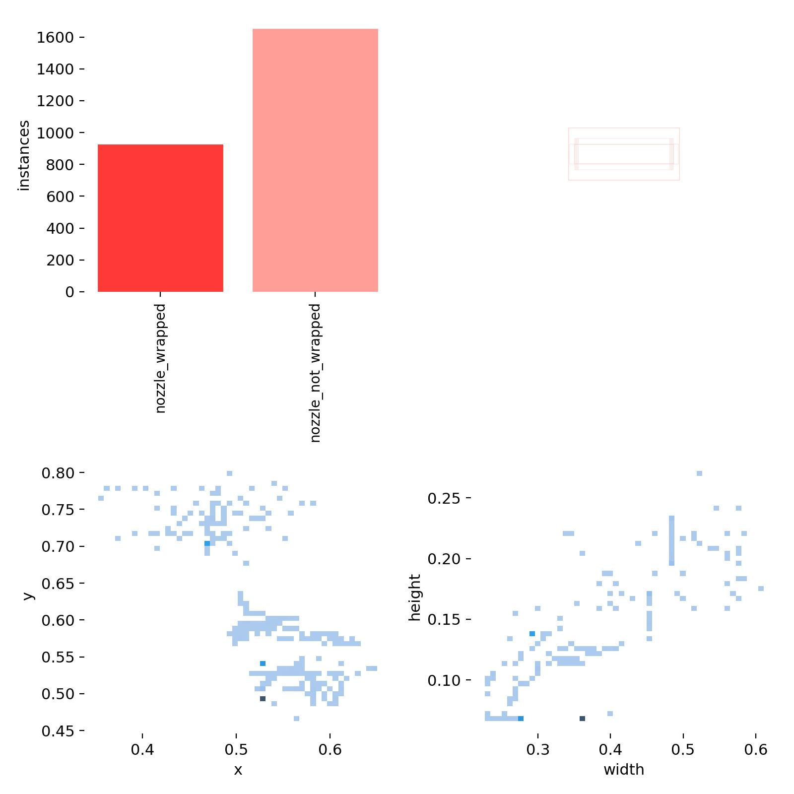

左上角柱状图显示类别 1 多于类别 0，与统计表中的 1647:922 一致。右上角显示框中心主要位于图像中下部，符合固定相机拍摄喷嘴的工况。下方宽高分布表明框尺寸集中、形状类型有限。优点是任务目标明确、学习容易；风险是相机位置或目标尺度明显改变时，模型可能不如当前验证集稳定。

### 图 2：标签参数相关性（labels_correlogram.jpg）

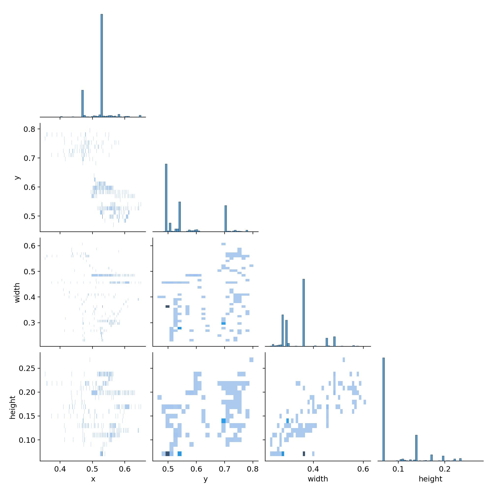

这张图不是模型精度图，而是训练标签中每个框的 4 个归一化参数之间的关系图：`x` 是框中心的左右位置，`y` 是框中心的上下位置，`width` 是框宽，`height` 是框高，数值都除以了原图宽高，所以范围是 0～1。

具体阅读方法如下：

- 对角线上的 4 个小图：分别看 `x、y、width、height` 自己的数量分布。峰越集中，说明该参数越固定。例如 `x、y` 集中，表示喷嘴和目标通常出现在相似位置。
- 非对角线小图：横轴取所在列的参数，纵轴取所在行的参数；每个点代表一个标注框。点形成一团，表示存在一类常见框；形成多团，表示存在多种典型位置或尺寸。
- 点带呈右上方向：两个参数正相关。例如 `width` 增大时 `height` 通常也增大，说明较大的裹头往往同时更宽、更高。
- 点带呈右下方向：两个参数负相关；接近圆形散点则表示关系较弱。

本图中 `x、y` 和框尺寸都有较明显的集中或成团现象，说明相机位置、喷嘴位置和目标尺度相对固定。这有利于模型快速学习，但也意味着模型可能习惯当前构图。因此外部验证应主动加入喷嘴位置偏移、拍摄距离改变、小型/大型裹头以及不同相机角度。该图主要用于发现数据偏置，不用于评价模型好坏。

### 图 3：训练批次 0（train_batch0.jpg）

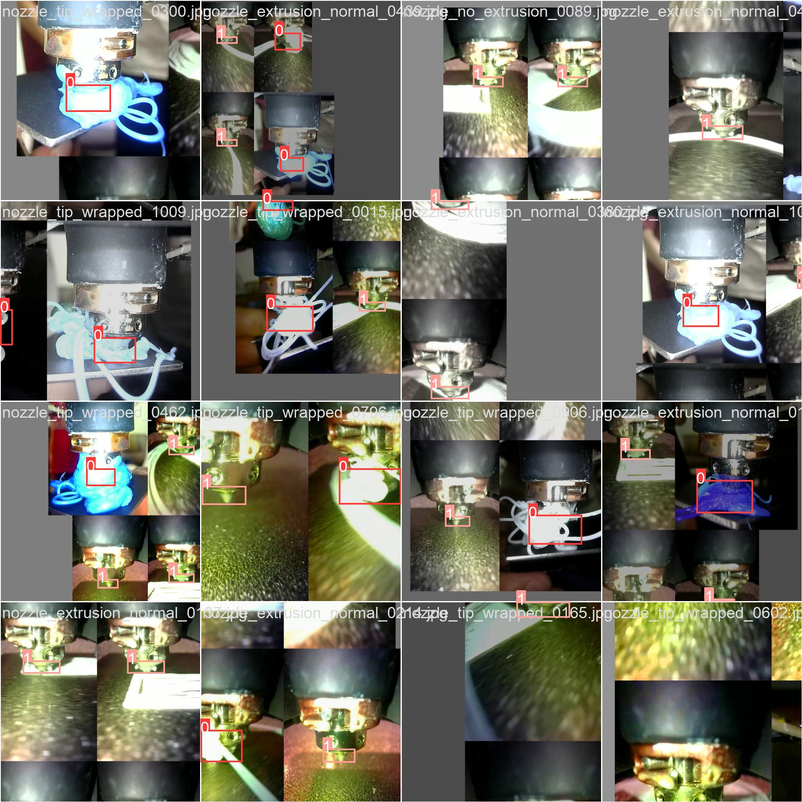

图中多张图片被拼接在同一训练画布内，是 Mosaic 增强的直接证据。类别编号 0、1 的框随缩放和平移同步变化，未见明显框与目标分离；亮度和颜色差异明显，说明 HSV 增强也在发挥作用。

### 图 4：训练批次 1（train_batch1.jpg）

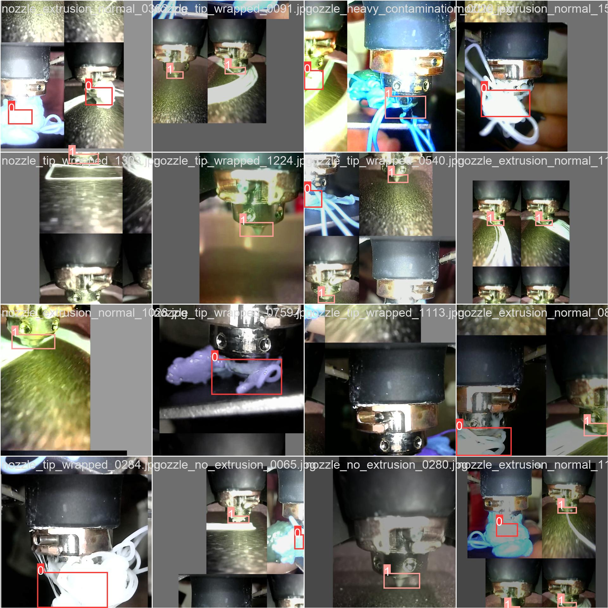

同样使用了 Mosaic、缩放和平移，可看到正常喷嘴、小型裹头和大型裹头等不同尺度。部分目标被拼接边界裁切，这是 Mosaic 的正常现象，可增强遮挡和局部目标鲁棒性，但也意味着训练图不能按原图画质来解读。

### 图 5：训练批次 2（train_batch2.jpg）

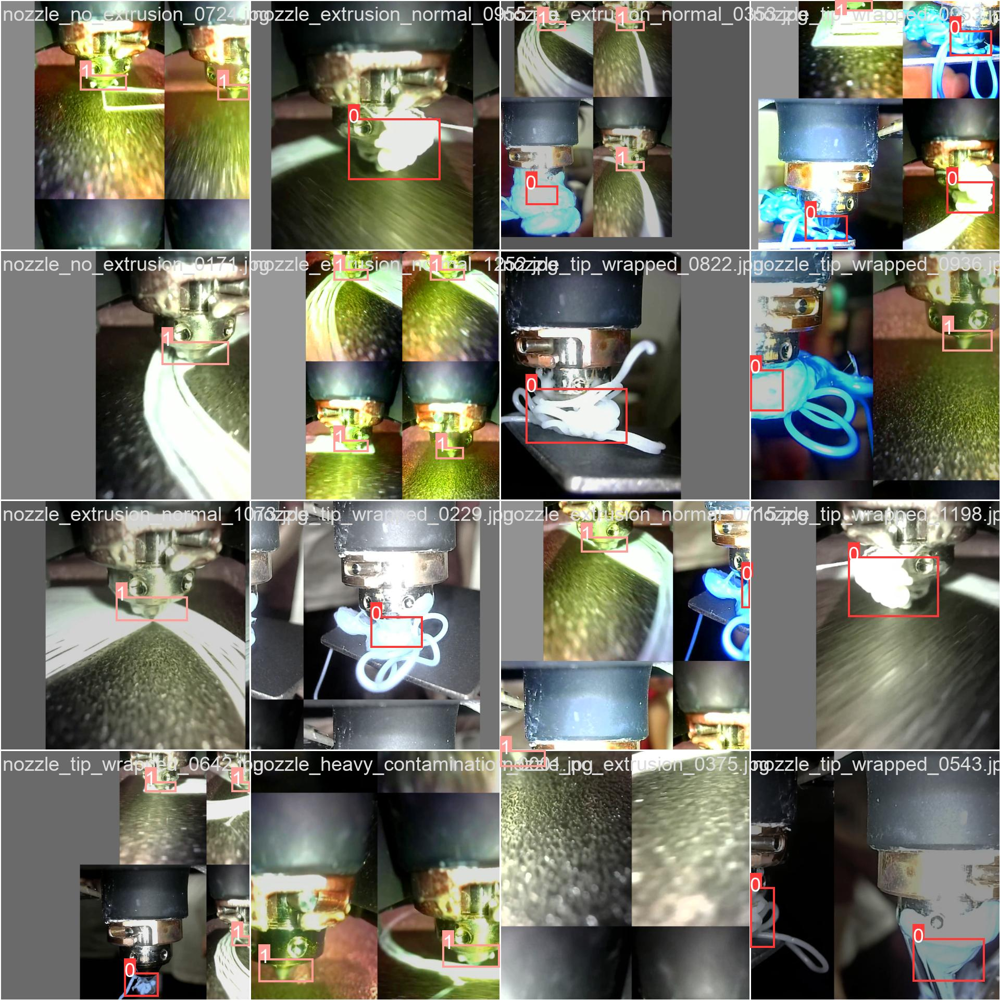

该批次进一步覆盖了过曝、暗光、不同材料颜色及大小框。标注框总体跟随目标正确。三张训练批次图共同证明本次并非“原图直接训练”，而是启用了 YOLOv5 标准在线增强。

**为什么生成图 3～图 5：** YOLOv5 保存训练开始阶段的前三个 batch，目的是进行训练输入质检。它们用于确认图片能正常读取、类别编号与类别含义正确、框经过缩放/翻转/Mosaic 后仍包住目标，以及数据增强确实生效。它们不是模型预测结果，也不用于计算 P、R 或 mAP。若这里出现错框、类别错误、黑图或严重不合理的增强，应停止训练并先修复数据或配置。

### 图 6：验证批次 0 真实标签（val_batch0_labels.jpg）

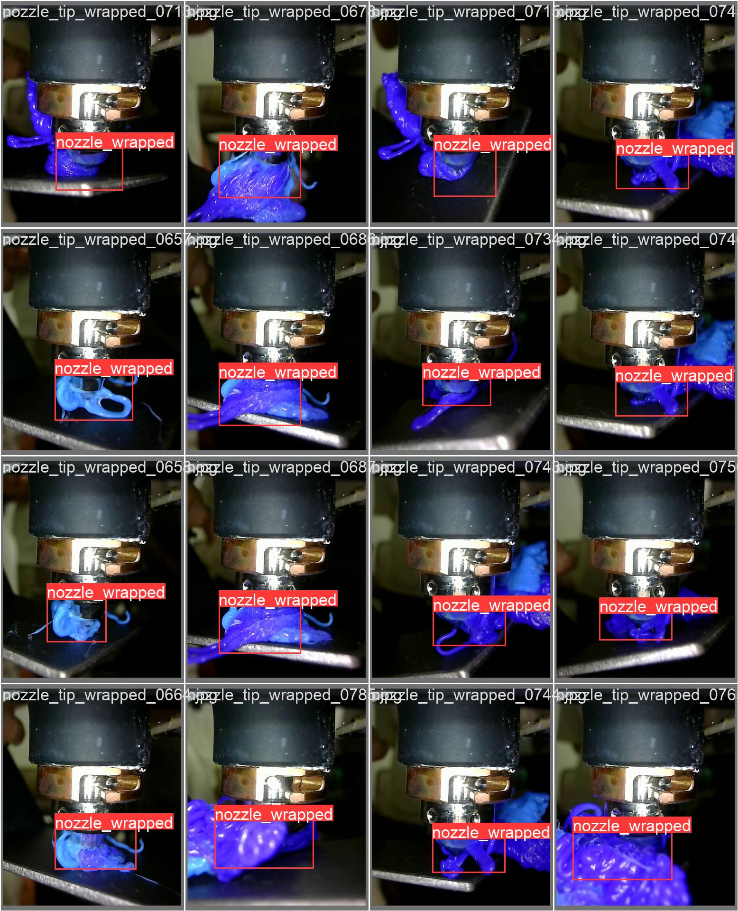

该批次主要为 `nozzle_wrapped`，裹头形态和大小有所变化，但拍摄背景和喷嘴位置相近。红框是人工真实标签，用来与下一张预测图逐图对照。

### 图 7：验证批次 0 模型预测（val_batch0_pred.jpg）

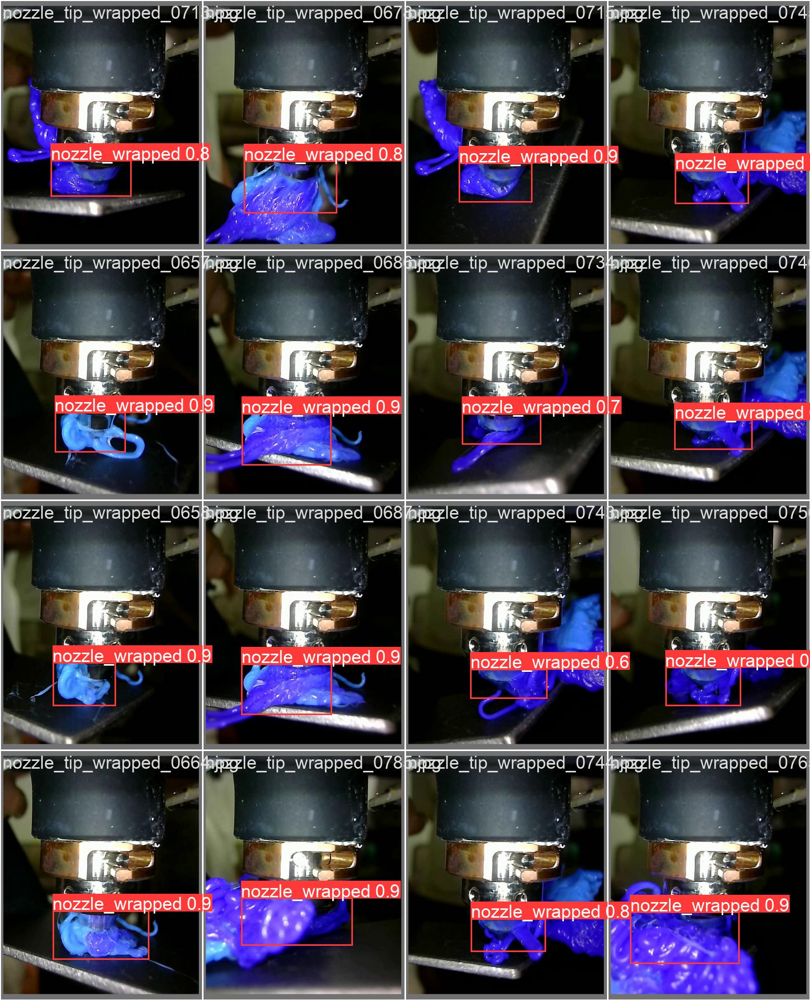

预测类别与图 6 基本一致，框位置也高度重合；多数置信度较高，少数样本约为 0.6～0.8。若部署阈值直接设为 0.7，这些靠近阈值的样本需要单独复测，因为它们可能在不同光照下变成漏检。

### 图 8：验证批次 1 真实标签（val_batch1_labels.jpg）

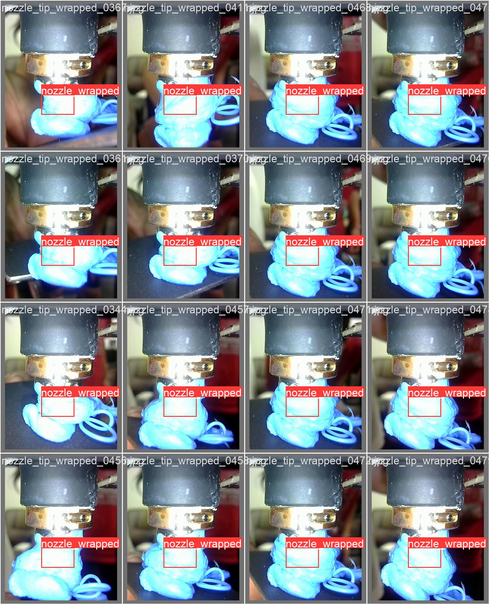

该批次是一组外观非常相近的浅蓝色大型裹头连续画面，真实框聚焦于喷嘴附近的核心裹头区域。它反映了实际视频抽帧数据的时间相关性。

### 图 9：验证批次 1 模型预测（val_batch1_pred.jpg）

全部样本均预测为 `nozzle_wrapped`，图中显示的置信度约为 1.0，预测框与真实框总体一致。这说明模型对该工况掌握很好；但同一工况内大量相似画面不能代替跨时间、跨设备测试。

### 图 10：验证批次 2 真实标签（val_batch2_labels.jpg）

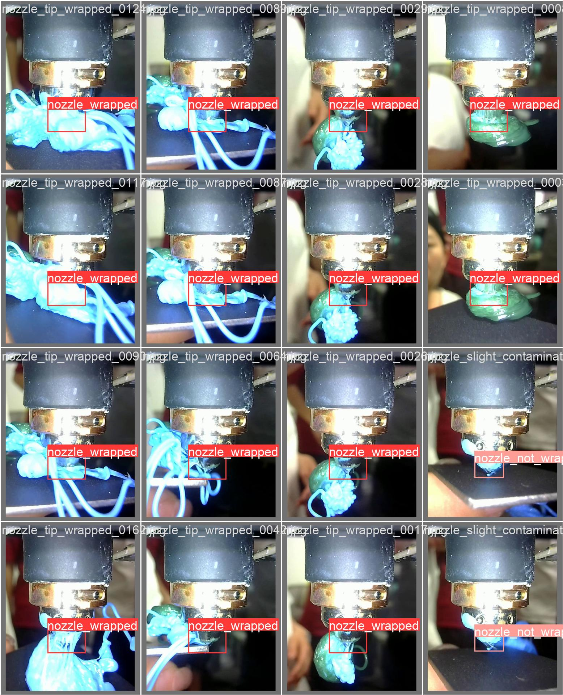

该批次以裹头为主，同时包含少量 `nozzle_not_wrapped`。部分原文件名仍保留原始细分类别名称，但红框上的二分类标签已按本项目映射为 wrapped/not_wrapped；文件名不是训练类别，TXT 标签中的类别编号才是训练依据。

### 图 11：验证批次 2 模型预测（val_batch2_pred.jpg）

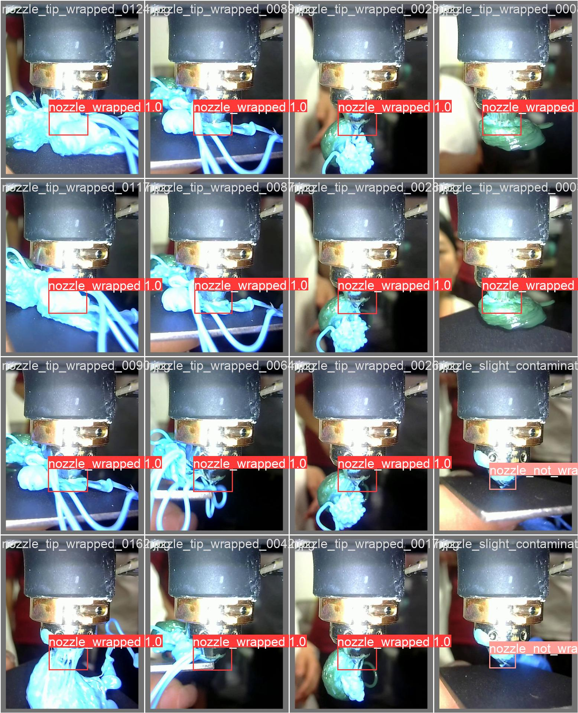

模型对两类均给出正确预测，图示置信度普遍接近 1.0，框与图 10 基本重合。该批次没有暴露明显误分类，但仍应在 test 集上统计具体错误清单，而不能只凭拼图抽样下结论。

**为什么生成图 6～图 11：** YOLOv5 从验证集保存 3 个 batch，每个 batch 各生成一张真实标签图（`labels`）和一张模型预测图（`pred`）。把同一批次的两张图并排比较，可以直观看出漏检、误检、类别混淆、预测框偏大/偏小及低置信度样本。这是一种定性抽查，能帮助人发现指标表格难以表达的问题；但它只展示验证集的一部分，正式结论仍应以完整验证集指标、混淆矩阵和逐图错误清单为准。

### 图 12：训练全过程曲线（results.png）

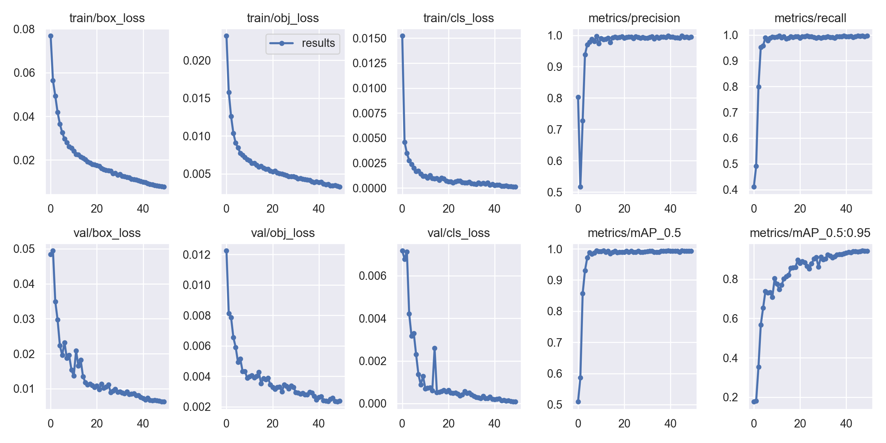

上排前三图是训练集的 box、objectness、classification loss，下排前三图是验证集对应 loss；它们整体持续下降，验证 loss 没有在后期持续反弹，因此未见明显过拟合。Precision、Recall、mAP@0.5 在前期迅速升高，mAP@0.5:0.95 随后继续缓慢提升至约 0.943，说明严格 IoU 条件下的框定位精度在后半程仍有改善。虚线/原始点的局部波动属于正常现象。

### 图 13：混淆矩阵（confusion_matrix.png）

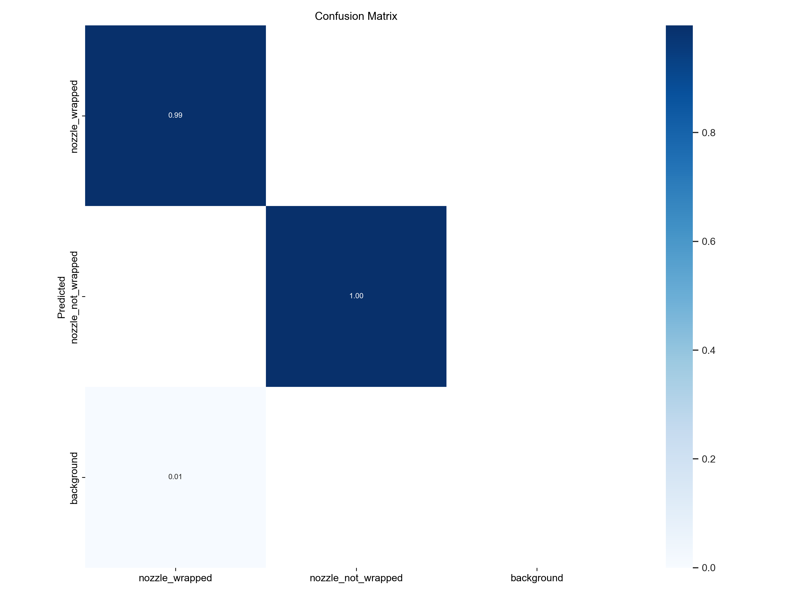

本项目仍然是二分类，`background` 不是第三个训练类别，也不在数据集 `names` 中。目标检测除了判断类别，还必须判断“有没有检测框与真实框匹配”，因此 YOLOv5 在混淆矩阵外加 background 行/列来记录漏检和误检：

- 最下面的 `background` 行：真实目标存在，但没有预测框成功匹配，是漏检（FN）。
- 最右侧的 `background` 列：模型给出了预测框，但没有真实框与它成功匹配，是误检（FP）。
- 中间 2×2 区域：才是两个真实类别之间的正确识别或互相错分。

坐标轴应按图上的标签读取：横轴是 True（真实类别），纵轴是 Predicted（预测类别）。矩阵已经归一化，`nozzle_wrapped` 正确识别约 0.99，`nozzle_not_wrapped` 约 1.00；图中主要剩余问题是极少量 wrapped 落入 background，即未检出，两个真实类别互相误判几乎没有。该图使用 YOLOv5 混淆矩阵的默认判断条件，通常为置信度 0.25、匹配 IoU 0.45，不能直接当作部署 `conf=0.7` 时的混淆矩阵。

### 图 14：PR 曲线（PR_curve.png）

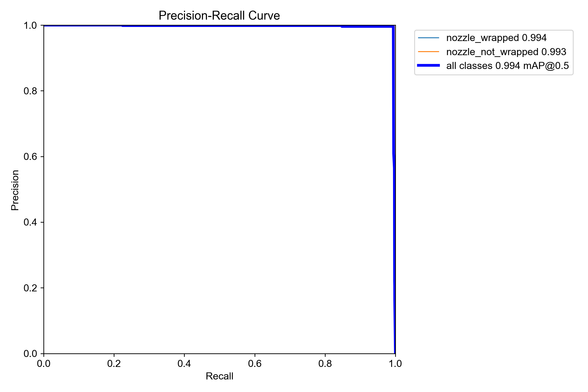

这是使用训练结束后选出的 `best.pt` 在**完整 val 集**上的预测结果绘制的 PR 曲线，不是 train 集曲线，也不是单张图片的曲线。验证时先以很低的 `conf=0.001` 保留候选预测并执行 NMS，然后在统计阶段从高到低遍历预测置信度，相当于尝试许多不同的置信度阈值；在 IoU=0.5 的正确匹配标准下，分别计算每个阈值对应的 Precision 和 Recall，连接起来就是一条 PR 曲线。

其中 Precision 表示保留下来的检测中有多少是真的，Recall 表示真实目标中有多少被找到了。曲线横轴为 Recall、纵轴为 Precision；曲线越靠近右上角、下面积越大越好。曲线下面积就是 AP@0.5。`nozzle_wrapped` 的 AP@0.5 为 0.994，`nozzle_not_wrapped` 为 0.993，总体 mAP@0.5 约 0.994。这里的曲线反映 val 集上阈值变化的总体表现，不代表某一个固定部署阈值。

### 图 15：F1—置信度曲线（F1_curve.png）

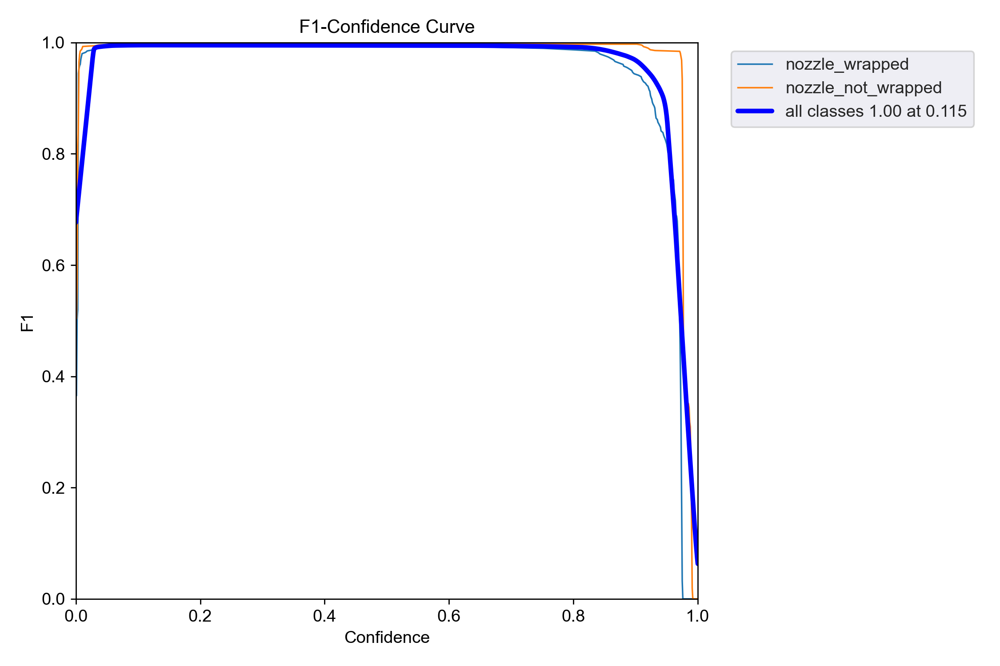

F1 是 Precision 与 Recall 的调和平均。横轴的 confidence 是模型在 **val 集预测框上输出的类别置信度阈值**，不是训练学习率、不是训练损失，也不是训练阶段固定使用的一个置信度。验证统计把阈值从 0 扫描到 1：只保留 `预测置信度 ≥ 当前阈值` 的框，再重新计算指标。图中自动标注的全类别最优点约为 `F1=1.00、conf=0.115`（显示值经过四舍五入）。这只是当前 val 集上 Precision 与 Recall 最均衡的参考点，不是工业部署阈值的唯一依据；裹头漏检代价高时，应优先确保 Recall，再结合误报成本选择阈值。

### 图 16：Precision—置信度曲线（P_curve.png）

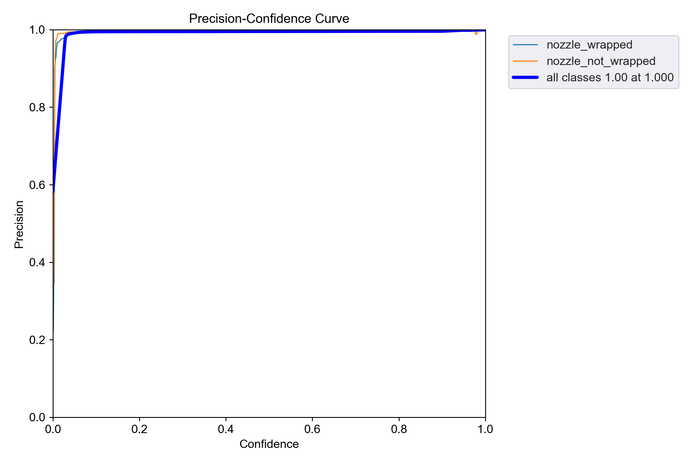

阈值较低时，模型保留的框多，其中可能混入更多误检；阈值提高后，低置信度误检先被过滤，因此 Precision 通常上升。图中 `conf=1.000` 时 Precision 显示为 1.00，只代表剩下的极少数最高置信预测没有误报，并不意味着应把部署阈值设为 1.0；阈值过高会同时过滤真目标并造成漏检。

### 图 17：Recall—置信度曲线（R_curve.png）

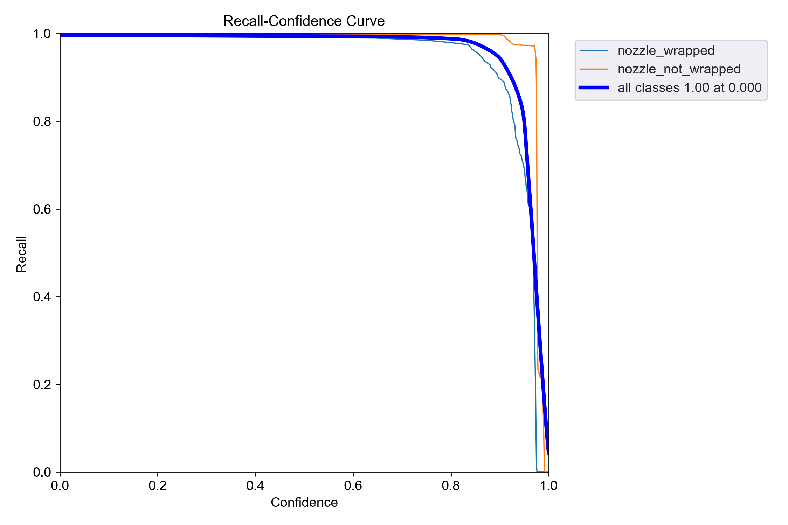

阈值较低时，大多数真目标预测都能保留，所以 Recall 较高；阈值升高后，一部分置信度不够高但实际正确的框也被过滤，因此 Recall 下降。`nozzle_wrapped` 在高阈值区域比 `nozzle_not_wrapped` 更早下降，因此部署使用 `conf=0.7` 前必须单独验证 wrapped 类的漏检率。当前曲线看，0.7 附近仍处于较高 Recall 区域，但应以 test 集精确统计为准。

图 15～图 17 使用的是同一套 best.pt 对 val 集的预测，只是纵轴分别换成 F1、Precision 和 Recall。其共同规律是：提高阈值通常会减少误检、提高 Precision，却可能增加漏检、降低 Recall；F1 用来寻找两者的折中点。工业裹头检测中漏检通常比误报更危险，所以阈值不应只按最高 F1 机械决定，而应结合 test 集漏检成本和现场报警策略确定。

## 5. 本次是否开启数据增强

**是，训练集开启了数据增强。** 实际 `hyp.yaml` 参数如下：

| 增强方式 | 参数 | 状态与含义 |
|---|---:|---|
| Mosaic | 1.0 | 开启；训练批次图中可直接看到四图拼接 |
| HSV 色调 | 0.015 | 开启 |
| HSV 饱和度 | 0.7 | 开启 |
| HSV 明度 | 0.4 | 开启 |
| 平移 | 0.1 | 开启 |
| 缩放 | 0.5 | 开启 |
| 左右翻转 | 0.5 | 开启，概率 50% |
| 上下翻转 | 0.0 | 关闭 |
| 旋转 | 0.0 | 关闭 |
| 剪切 | 0.0 | 关闭 |
| 透视变换 | 0.0 | 关闭 |
| MixUp | 0.0 | 关闭 |
| Copy-Paste | 0.0 | 关闭 |

这些增强只用于训练集的在线加载过程，不会改写硬盘中的原始图片。验证集不会使用 Mosaic、HSV、翻转等随机训练增强，只进行尺寸适配等确定性预处理，因此验证指标仍基于未随机增强的 val 图像。

## 6. 结果文件用途

- `weights/best.pt`：按 fitness 选出的最佳模型，后续 test 测试和推理优先使用。
- `weights/last.pt`：第 50 轮结束时的模型，主要用于续训和对照。
- `results.csv`：50 轮逐轮数值，是精确分析和后续实验比较的依据。
- `results.png`：由 `results.csv` 绘制的训练趋势概览。
- `opt.yaml`：本次命令行训练参数快照。
- `hyp.yaml`：本次实际超参数及数据增强参数快照。

## 7. 下一步建议

1. 目前不要评估 test 集。先将本次 B0 的配置、val 指标和权重哈希固化，后续增强、模型和超参数实验统一只根据 val 集选择。
2. 保留 B0 的标准增强，再增加一个只改变增强开关的消融实验，例如 B1-noaug；其余网络、预训练权重、数据划分、epoch、batch、seed 和评价方式必须与 B0 相同。
3. 根据 val 结果确定最终训练方案，并在 val 集上完成 `conf=0.7` 的合理性检查；不得根据 test 结果反复修改方案或阈值。
4. 模型结构、增强、超参数和部署阈值全部确定后，锁定对应的 `best.pt`，再对冻结的 test 集做一次最终评估，统计两类 Precision、Recall、mAP、混淆矩阵和逐图错误，尤其关注 wrapped 漏检。
5. 补充独立的新时间、新材料、新光照或新设备数据作为外部验证，检验模型是否依赖固定背景与连续帧特征。

## 8. 关于标准增强基线与无增强消融

本次 B0 使用的 `hyp.scratch-low.yaml` 中 Mosaic、HSV、平移、缩放和左右翻转，属于 YOLOv5 v7.0 官方标准低增强配置，因此 B0 的含义是“标准 YOLOv5s 训练基线”，不是“零增强基线”。基线的作用是提供公认、可复现的参照方案，并不要求关闭所有增强。

若要回答“数据增强是否有效”，应增加一个无增强或分组消融实验，而不是修改已经完成的 B0：

- B0-standard-aug：保留本次官方标准增强。
- B1-noaug：关闭 Mosaic、HSV、平移、缩放和翻转，其余配置与 B0 完全相同。
- 如需继续分析，再分别增加 B2-no-mosaic、B3-no-hsv 等单因素实验。

各实验应使用完全相同的 train/val 划分、YOLOv5s 结构、`yolov5s.pt` 初始权重、50 epoch、batch 16、seed 0 和最佳权重选择规则，只比较 val 指标、收敛速度以及漏检/误检情况。为了降低单次随机性的影响，正式结论最好对关键方案使用多个随机种子重复训练，并比较均值和波动。test 集不参与这些增强方案的选择。
